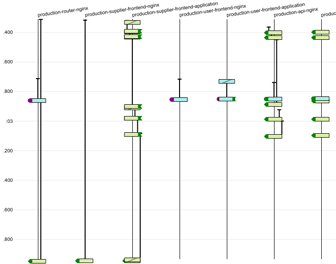

digitalmarketplace-logdia
=========================

A single-page, self-contained app which generates interactive diagrams like this:

given JSON logs from digitalmarketplace services. A statically-served version is available
[here](https://alphagov.github.io/digitalmarketplace-logdia) for convenience.

This can also be built into a Web Extension for Firefox or Chrome. The build process is defined in the file `default.nix`,
which also pulls in clean versions of dependencies for reproducible builds.

Installing as a Web Extension allows users to generate log diagrams in a 1-click fashion direct from kibana.
